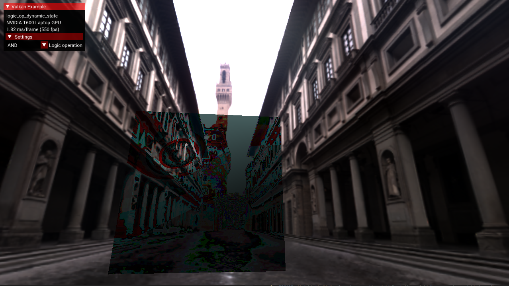

<!--
- Copyright (c) 2023, Mobica Limited
-
- SPDX-License-Identifier: Apache-2.0
-
- Licensed under the Apache License, Version 2.0 the "License";
- you may not use this file except in compliance with the License.
- You may obtain a copy of the License at
-
-     http://www.apache.org/licenses/LICENSE-2.0
-
- Unless required by applicable law or agreed to in writing, software
- distributed under the License is distributed on an "AS IS" BASIS,
- WITHOUT WARRANTIES OR CONDITIONS OF ANY KIND, either express or implied.
- See the License for the specific language governing permissions and
- limitations under the License.
-
-->

# Logic operations dynamic state



The [VK_EXT_extended_dynamic_state2](https://registry.khronos.org/vulkan/specs/1.3-extensions/man/html/VK_EXT_extended_dynamic_state2.html) extension allows to use dynamic states e.g. the VK_DYNAMIC_STATE_LOGIC_OP_EXT. This may help an application to change a logic operation used without creating a new pipline.

The sample demonstrates usage of this extension with dynamically changed logical operations applied for blending.

## Overview

## Pipelines

## Enabling the Extension


The extended dynamic state 2 API requires Vulkan 1.0 and the appropriate headers / SDK is required. This extension has been [partially](https://registry.khronos.org/vulkan/specs/1.3-extensions/man/html/VK_EXT_extended_dynamic_state2.html#_promotion_to_vulkan_1_3) promoted to Vulkan 1.3.

The device extension is provided by `VK_EXT_EXTENDED_DYNAMIC_STATE_2_EXTENSION_NAME`. It also requires 
`VK_KHR_GET_PHYSICAL_DEVICE_PROPERTIES_2_EXTENSION_NAME` instance extension to be enabled.

```C++
add_instance_extension(VK_KHR_GET_PHYSICAL_DEVICE_PROPERTIES_2_EXTENSION_NAME);
add_device_extension(VK_EXT_EXTENDED_DYNAMIC_STATE_2_EXTENSION_NAME);
```

Additional features are provided by the VkPhysicalDeviceExtendedDynamicState2FeaturesEXT struct:

extendedDynamicState2LogicOp indicates that the implementation supports the following dynamic state: VK_DYNAMIC_STATE_LOGIC_OP_EXT

```C++
typedef struct VkPhysicalDeviceExtendedDynamicState2FeaturesEXT {
    VkStructureType    sType;
    void*              pNext;
    VkBool32           extendedDynamicState2;
    VkBool32           extendedDynamicState2LogicOp;
    VkBool32           extendedDynamicState2PatchControlPoints;
} VkPhysicalD
